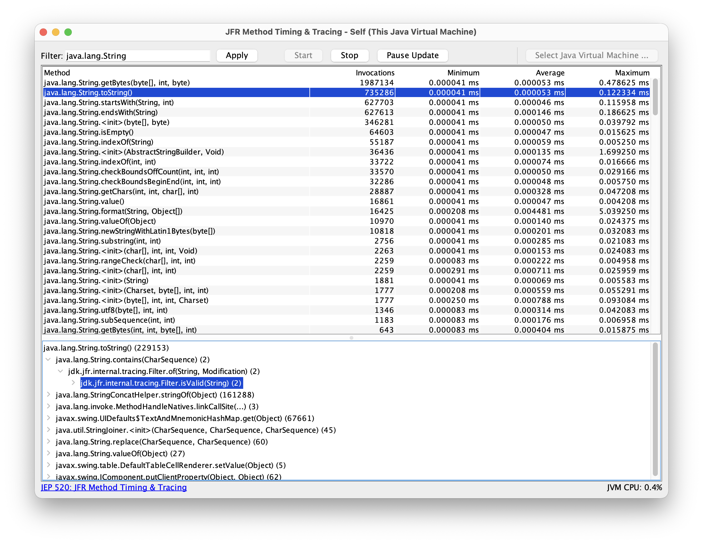

# Description

JEP 520, *JFR Method Timing & Tracing*, added two new events for tracing and timing methods. Timing and tracing method invocations can help identify performance bottlenecks, optimize code, and find the root causes of bugs.

To validate the design and demonstrate how third-party tools can use the JFR APIs with these two new events, a Java Swing program called **Method Tracer** was created.

# Usage

    $ git clone https://github.com/flight-recorder/method-tracer
    $ cd method-tracer
    $ java MethodTracer.java

It is also possible to start Method Tracer with a source:

    $ java MethodTracer.java [source]

## [source]

The source specifies where Method Tracer streams events from. It can be a network address, a JMX service URL, or `self`. If the parameter is omitted, a dialog will be displayed where the source can be selected.

#### Network address

Method Tracer can stream events over JMX, but it requires the management agent to be running on the target JVM. The management agent can be started by specifying the following properties at startup:

    $ java -Dcom.sun.management.jmxremote.port=7091 \
           -Dcom.sun.management.jmxremote.authenticate=false \
           -Dcom.sun.management.jmxremote.ssl=false \
           com.example.MyApplication

The management agent can also be started using `jcmd`:

    $ jcmd com.example.MyApplication \
           ManagementAgent.start \
           jmxremote.port=7091 \
           jmxremote.authenticate=false \
           jmxremote.ssl=false

Examples:

    $ java MethodTracer.java example.com:7091
    $ java MethodTracer.java service:jmx:rmi:///jndi/rmi://com.example:7091/jmxrmi

Additional information on how to set up the management agent can be found [here](https://docs.oracle.com/en/java/javase/16/management/monitoring-and-management-using-jmx-technology.html). Method Tracer does not support SSL or authentication, so it should not be used in environments where security is a concern.

#### Self

Specify `self` to make Method Tracer stream events from itself. This is mostly useful for debugging and demonstration purposes.

Example:

    $ java MethodTracer.java self